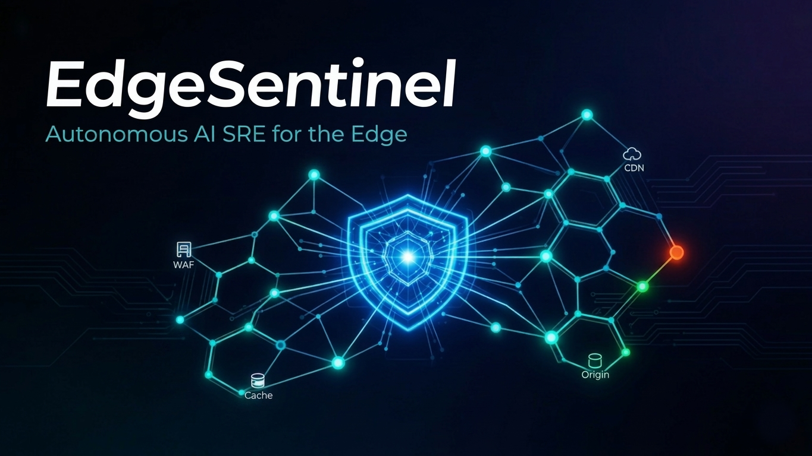

# EdgeSentinel



EdgeSentinel is an AI-assisted operations console for Tencent Cloud EdgeOne.
It combines a browser-based chat experience, an existing 25-specialist Google
ADK agent team, and a durable incident workflow for investigating and safely
responding to CDN/WAF events.

The project is designed for a demo-safe progression from human-guided
investigation to a tightly constrained proactive response. EdgeOne API logic
remains in the backend agent package; the web services and UI do not duplicate
provider-specific request logic.

## What it does

- **Chat with an EdgeOne engineering team.** The orchestrator routes requests
  to specialists for the 25 EdgeOne API categories, streams their activity,
  exposes tool calls, and presents the returned evidence in the Chat UI.
- **Receive TCOP alarms as incident tickets.** Authenticated callbacks create
  durable SQLite-backed incidents, correlate trigger and recovery notifications,
  and retain an auditable activity timeline.
- **Investigate requests-flood incidents.** The workflow gathers read-only
  traffic, top-client-IP, and security-policy evidence before making a
  recommendation.
- **Recommend and apply guarded mitigation.** A reviewed client IP can become
  a versioned block-rule recommendation. Execution re-reads the policy and
  rejects stale proposals before calling EdgeOne.
- **Demonstrate proactive response.** The Incidents page can enable a
  deliberately narrow Proactive Agent Team demo mode. It investigates
  immediately, qualifies a requests-flood signature, obtains a restricted
  agent assessment, and can auto-approve the deterministic block-IP path when
  its demo flags are explicitly enabled. Missing client-IP evidence still
  triggers bounded delayed rechecks rather than an initial blanket wait.

## Architecture

```text
Browser (5173)
   │  CopilotKit React SDK
   ▼
copilot-runtime (3001) ── AG-UI over HTTP ──▶ backend (8000)
  Express protocol bridge                      FastAPI
  no EdgeOne business logic                    /agui → ADK root agent
                                                /api  → incidents, settings,
                                                        monitoring, health
                                                edgeone_agents/ → all EdgeOne
                                                                  API logic
```

| Service | Stack | Port | Responsibility |
|---|---|---:|---|
| `backend/` | Python, FastAPI, Google ADK | 8000 | Agent team, AG-UI endpoint, incident REST APIs and workers |
| `copilot-runtime/` | Node, Express, CopilotKit | 3001 | Protocol bridge and sanitized AG-UI activity telemetry only |
| `frontend/` | React, TypeScript, Vite | 5173 | Dashboard, Chat, Incidents, Settings, and human approvals |

## Repository layout

```text
backend/
  edgeone_agents/       # Agent definitions and the only EdgeOne API logic
  app/                  # Thin FastAPI shell, incident services, workers
  tests/
copilot-runtime/        # CopilotKit ↔ AG-UI protocol bridge
frontend/               # React operations console
EdgeSentinel.png        # README banner
```

## Run locally

Run each service in a separate terminal.

### 1. Backend

```bash
cd backend
python -m venv .venv
source .venv/bin/activate       # Windows: .venv\Scripts\activate
pip install -r requirements.txt
cp .env.example .env
# Configure provider credentials and demo flags in .env
python main.py                   # http://localhost:8000
```

The FastAPI API reference is available at `http://localhost:8000/docs`.

### 2. Copilot runtime

```bash
cd copilot-runtime
npm install
cp .env.example .env
npm run dev                      # http://localhost:3001
```

### 3. Frontend

```bash
cd frontend
npm install
cp .env.example .env
npm run dev                      # http://localhost:5173
```

Open `http://localhost:5173`. The Chat page can answer requests such as
“list all edge functions for zone-…”, while Incidents is the workflow for
TCOP callback ingestion and response demonstrations.

## Configuration and safety

- Copy each `.env.example` to `.env`; never place real credentials in an
  example file or in the frontend.
- The backend supports Gemini by default and an OpenAI/LiteLLM path when
  `EDGEONE_LLM_PROVIDER=openai` and `OPENAI_API_KEY` are configured.
- TCOP callback authentication and incident/proactive worker settings are
  configured in `backend/.env`.
- `ModifySecurityPolicy` is a replacement-style API. The incident workflow
  reads and fingerprints the current policy before a guarded execution so it
  does not silently overwrite a changed policy.
- Proactive auto-approval/auto-execution flags are **demo controls**, not a
  production authorization system. Keep them disabled outside a controlled
  environment.

## Verify changes

```bash
# Backend
cd backend
.venv/bin/python -m py_compile $(find . -name "*.py" -not -path "./.venv/*")
.venv/bin/python -m unittest tests.test_alarm_ingestion

# Copilot runtime
cd ../copilot-runtime
npm run build

# Frontend
cd ../frontend
npm run lint
npm run build
```

## Preparing a GitHub push

The root [`.gitignore`](./.gitignore) excludes real `.env` files, local
SQLite/ADK state, virtual environments, package installs, generated builds,
logs, archives, and certificate/key material. It deliberately keeps
`.env.example`, lockfiles, source, tests, and this banner image.

Before the first push, review the staged file list rather than assuming an
ignore rule can remove files already added to Git:

```bash
git init                         # only if this directory is not already a repo
git add .
git status --short
git diff --cached --check
```

If a credential was ever committed to any branch, rotate it with the provider
first; adding it to `.gitignore` does not remove it from Git history.

## Design rules

All Tencent Cloud/EdgeOne API construction belongs in
`backend/edgeone_agents/`; `backend/app/` is an HTTP shell,
`copilot-runtime/` is a protocol bridge, and the frontend renders data only.
The backend's [agent-team README](./backend/README.md) describes that package
in more detail.
